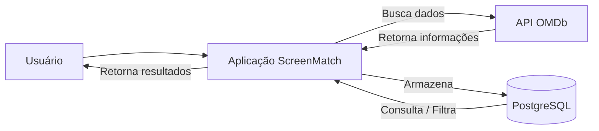

# 🎬 ScreenMatch

Aplicação Java com Spring Boot que consome a API pública da **OMDb** para buscar informações sobre séries, armazená-las em um banco de dados PostgreSQL e permitir operações de consulta e manipulação.

---

## 📊 Fluxo da Aplicação

## 🚀 Funcionalidades

- Consumo da API **OMDb** para buscar séries  
- Armazenamento das informações no banco **PostgreSQL**  
- Operações de listagem, filtragem e busca  
- Uso de **Optional** para evitar `NullPointerException`  
- Processamento de dados com **Java Streams**  
- Modelagem de dados orientada a objetos  

---

## 🛠️ Tecnologias Utilizadas

- **Java** (Spring Boot)  
- **PostgreSQL**  
- **API OMDb**  
- **Maven**  

---

## 📚 Aprendizados

- Consumo de APIs REST  
- Tratamento e validação de dados recebidos  
- Modelagem de dados e persistência com JPA  
- Uso de `Optional` e `Stream` para operações mais seguras e expressivas  
- Fluxo de operações em Java para manipulação de listas e resultados  
